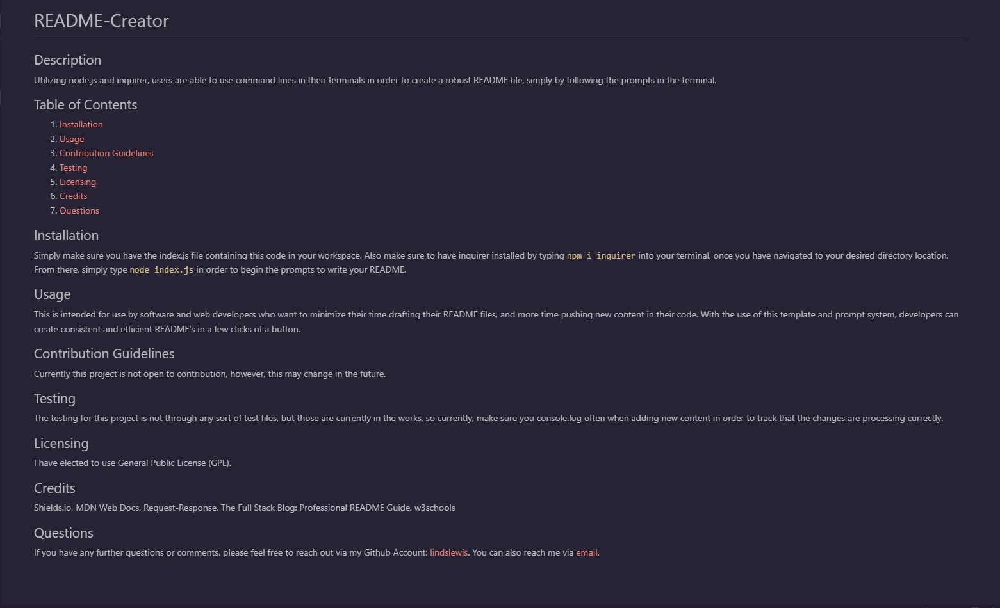

# README-Creator

## Description
Utilizing node.js and inquirer, users are able to use command lines in their terminals in order to create a robust README file, simply by following the prompts in the terminal. 

## Table of Contents
1. [Sample README](#Sample-README)
2. [Walkthrough Video](#Walkthrough-Video)
3. [Installation](#Installation)
4. [Usage](#Usage)
5. [Contribution Guidelines](#Contribution-Guidelines)
6. [Testing](#Testing)
7. [Licensing](#Licensing)
8. [Credits](#Credits)

## Sample README

## Walkthrough Video

## Installation
Simply make sure you have the index.js file containing this code in your workspace. Also make sure to have inquirer installed by typing ``npm i inquirer`` into your terminal, once you have navigated to your desired directory location. From there, simply type ``node index.js`` in order to begin the prompts to write your README.

## Usage
This is intended for use by software and web developers who want to minimize their time drafting their README files, and more time pushing new content in their code. With the use of this template and prompt system, developers can create consistent and efficient README's in a few clicks of a button. 

## Contribution Guidelines
Currently this project is not open to contribution, however, this may change in the future.

## Testing
The testing for this project is not through any sort of test files, but those are currently in the works, so currently, make sure you console.log often when adding new content in order to track that the changes are processing currectly.

## Licensing
No licensing at this time.

## Credits
1. Shields.io
2. MDN Web Docs
3. Request-Response The Full Stack Blog: Professional README Guide
4. w3schools